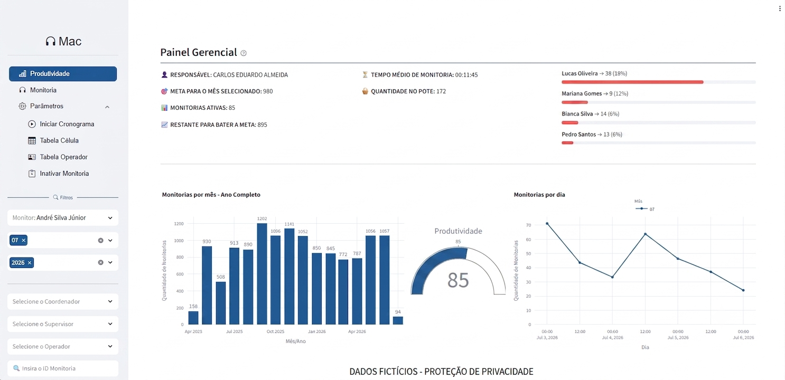
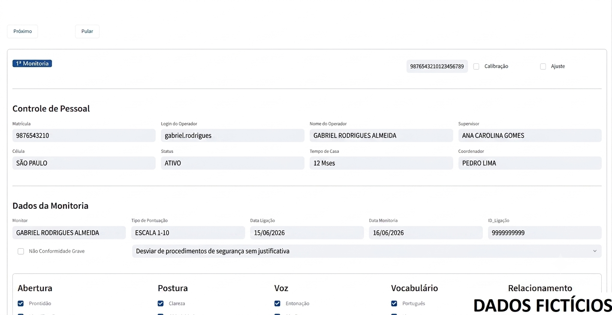

# 📊 Monitoramento e Acompanhamento de Colaboradores

LinkedIn:
https://linkedin.com/in/rafael-h-03b98970

> ⚠️ Este repositório tem como objetivo apresentar o projeto e suas funcionalidades. O código-fonte não é disponibilizado por conter informações e regras de negócio da empresa.

---

## 🚀 Sobre o projeto

A ferramenta foi desenvolvida utilizando Python e Streamlit para disponibilizar uma plataforma web de uso interno, voltados à monitoria das ligações do callcenter.

A solução centraliza processos que antes eram realizados de forma manual ou distribuídos em diferentes planilhas, proporcionando maior organização, agilidade e facilidade no acesso às informações.

---

## 🛠️ Tecnologias utilizadas

- Python
- Streamlit
- MySql
- Pandas
- HTML
- CSS

---

## 📷 Telas do sistema

### Página Inicial

---

### Sistema de Monitoria

---

